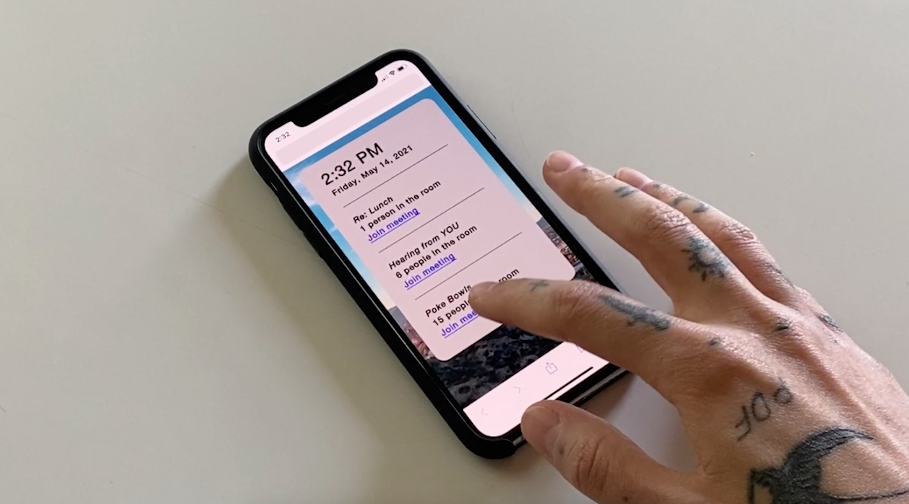
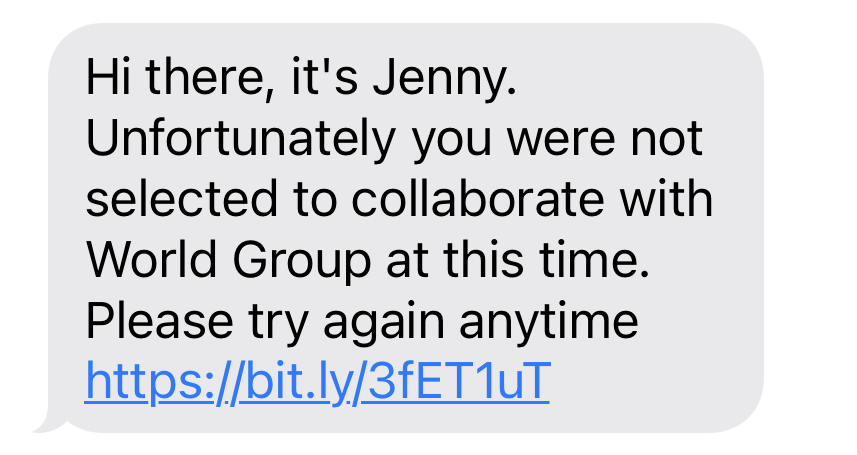

# world group
a project in collaboration with [luiza dale](http://luizadale.com) created in spring 2021
 
a sequel of sorts to [jenny](http://luizadale.com/jenny)
 
~
 
text 'jenny' to 1.334.641.1003 for an invitation to take part in an exciting employment opportunity at the agency world group

 
~
 
attend meetings with a contract worker named jenny to get a hang of what world group is and represents

 

 

 

 
~
 
you can always apply to world group in the future. we’re constantly hiring
 

 
