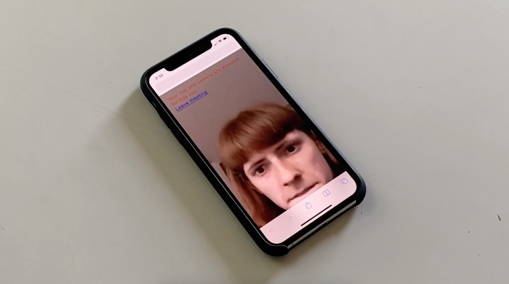

# world group
a project in collaboration with [luiza dale](http://luizadale.com) 
 
a sequel of sorts to [jenny](http://luizadale.com/jenny)
 
text 'jenny' to 1.334.641.1003 for your invitation to take part in an exciting employment opportunity at the agency world group

 
you’ll attend meetings with a contract worker named jenny to get a hang of what world group is and represents

 

 

 
while you’re ultimately not selected to come on full time, you can always apply to world group in the future. we’re constantly hiring

 

 
